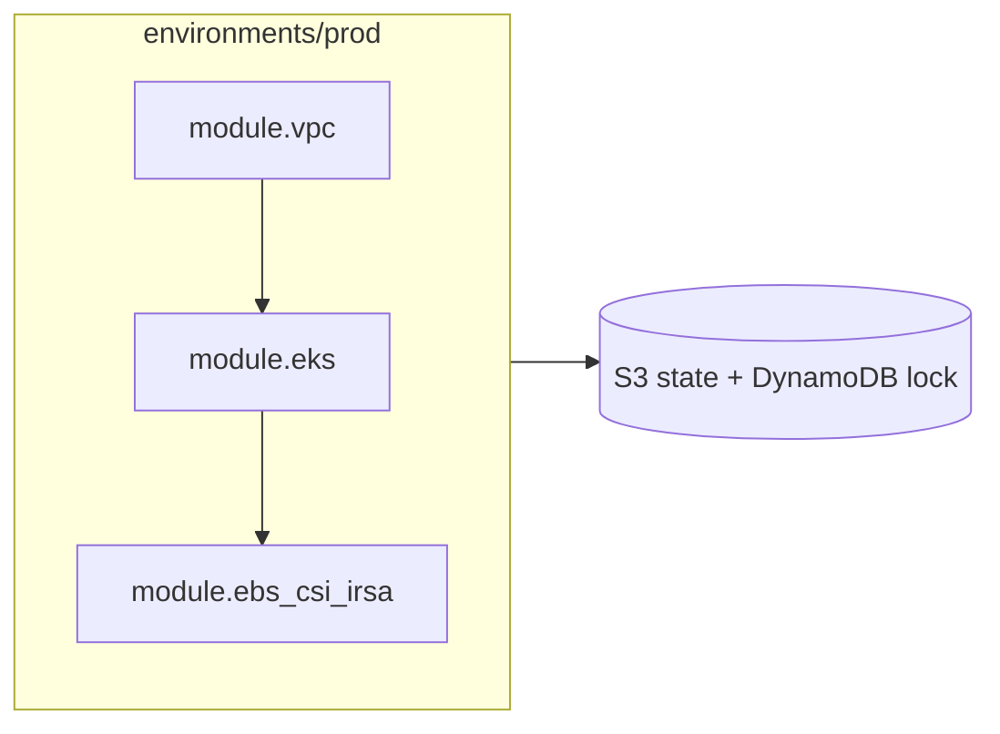
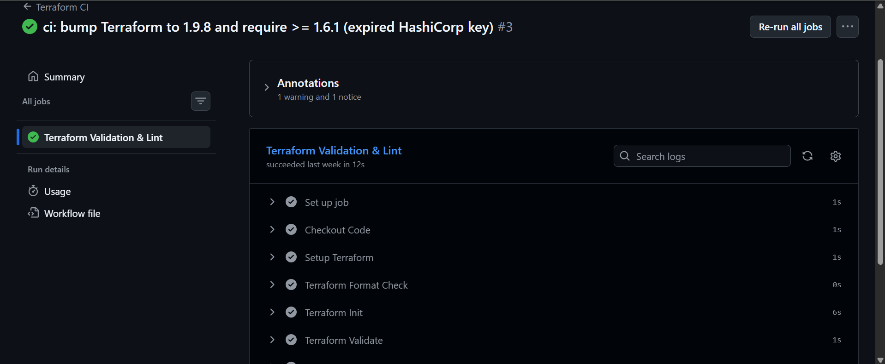

# platform-infrastructure


Terraform modules for an AWS EKS platform: a VPC, an EKS cluster, and IAM Roles for Service Accounts (IRSA). Every push is formatted-checked, initialised, and validated by GitHub Actions.

> **Status:** validated in CI, **not applied** to a real AWS account. EKS and NAT gateways cost money by the hour, so this repo is a reviewed, working design and not a running environment.

## Architecture



## Repo layout

```
environments/prod/        # root config: main, providers, variables, outputs, backend
modules/vpc/              # network for the cluster
modules/eks/              # EKS cluster
modules/irsa/             # IAM role for a Kubernetes service account (OIDC)
.github/workflows/        # Terraform CI
```

## Modules

| Module | Purpose |
|---|---|
| `vpc` | VPC and networking the cluster runs in |
| `eks` | The EKS cluster |
| `irsa` | Reusable IAM role for a Kubernetes service account via the cluster's OIDC provider; used here for the EBS CSI driver |

## CI

On every push and pull request to `main`, GitHub Actions runs:

1. `terraform fmt -check -recursive`
2. `terraform init -backend=false`
3. `terraform validate`

The backend is disabled in CI, so no AWS credentials are needed.



## Remote state

Production state is configured for an S3 bucket (encrypted) with a DynamoDB table for state locking. These two resources are not created by this repo and must exist before `terraform init`.

## Usage (not applied)

Requires Terraform `>= 1.6.1` and AWS credentials.

```bash
cd environments/prod
terraform init
terraform plan
```

`terraform apply` creates billable AWS resources. Run `terraform destroy` when you are done.

## Lessons learned

- **`openpgp: key expired` in CI.** HashiCorp's provider-signing key expired in April 2026, and Terraform versions older than 1.6.1 could not verify providers. Fixed by bumping CI to Terraform 1.9.8 and setting `required_version = ">= 1.6.1"`.
- **Never commit `.terraform/`.** My first push included a 674 MB provider binary and GitHub rejected it (100 MB file limit). Fixed with a `.gitignore` and a clean history.
- **Do commit `.terraform.lock.hcl`.** It pins provider versions so every run installs the same ones.
